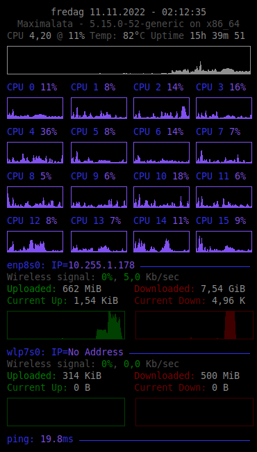

 # Conky-Config
A modular Conky configuration

A modular Conky configuration that is being built on your machine based on the actually available hardware without any hardcoded information.
So far supported:
- General hardware information like atchitecture, kernel, CPU temperature and machine uptime
- The # of CPU cores: Up to 6 cores will be shown in 2 columns, above it'll be 6 columns. Current Clock per core is only shown for >=6 cores.
- Networking interfaces: Any interface of status UP or RINNING will be shown, so both cable and wifi should show up and provide detailed information.
- Ping warning: Should pings fail, a bright red text will inform you

WARNING:
Your previous conky config will be overwritten, you have to create a backup on your own.
You can find the config file in `/etc/conky/conky.conf`

Installation:
- Install Conky via `sudo apt install conky-all`
- Run `conky_INSTALL.sh` as superuser once (`sudo ./conky_INSTALL.sh`)

Launching:
- Run `conky_LAUNCHER.sh` (no sudo required)

How it works:
The installation script `conky_INSTALL.sh` creates tiny scripts in `/etc/conky/` which will be called upon for live data. All they to is request data, parse it (grep grep grep) & echo it back.
The Launcher `conky_LAUNCHER.sh` will call `conky_CreateConfig.sh` and overwrite your previous conky config with its returning text, sleep for a second and then launch Conky, which will in return use the freshly created conky config file.
`conky_CreateConfig.sh` is where the magic happens: The script will take a look at you hardware (# of cpu cores, networking interfaces & their status, etc) and create a new Conky configuration that's just right for your setup, showing only the sensory data that is available. No need to remove unwanted graphs for additional cores, no need to modify the config so it recognizes your network card (which propably won't be `eth0`. It does all that for you :)

What's missing:
So far no statistics about harddrives and file transfers is available. Also colors are static, meaning cpu usage does not show stress via color change.

Known issues:
When switching from simple config to a config creation script, some methods were frozen: No live data is being pulled anymore, which includes your IP. Future updates will fix this.
